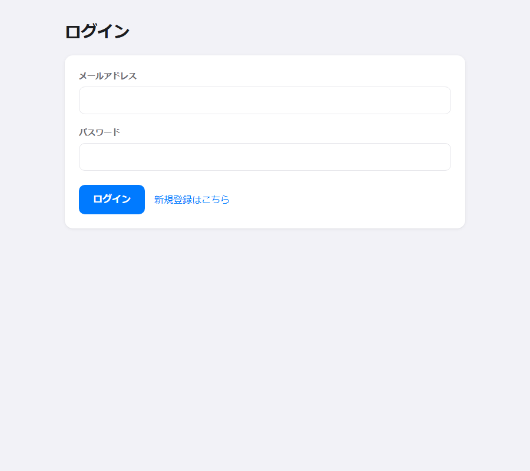
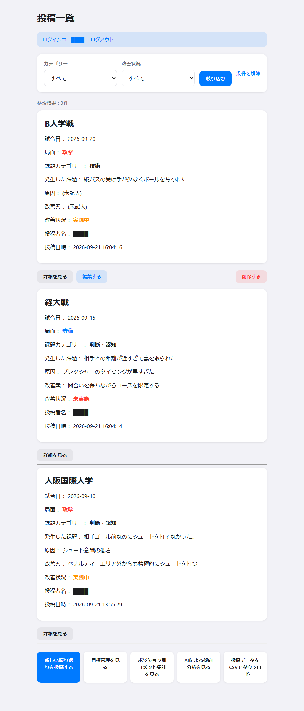
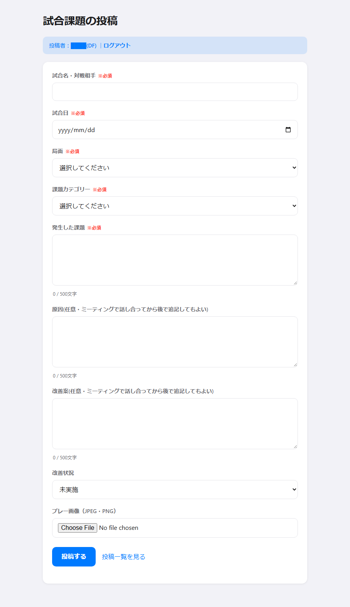
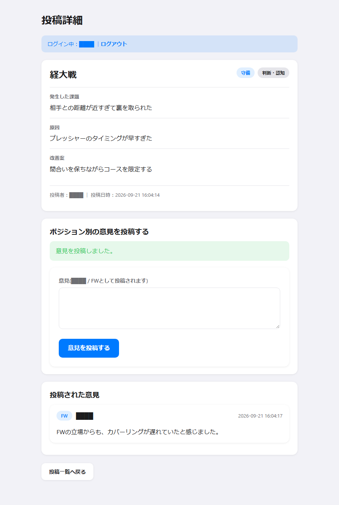
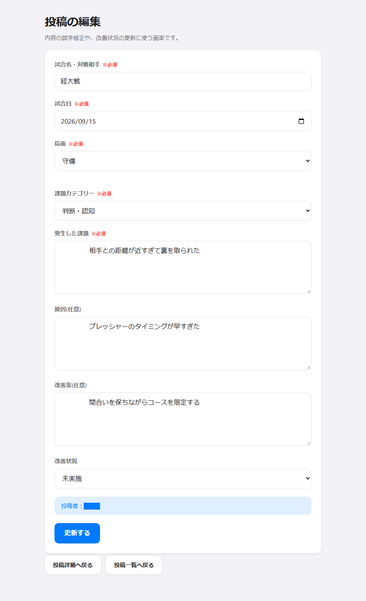
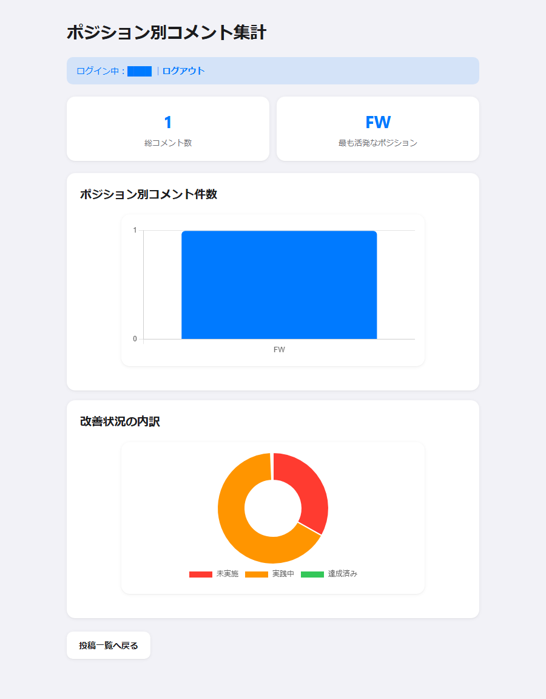
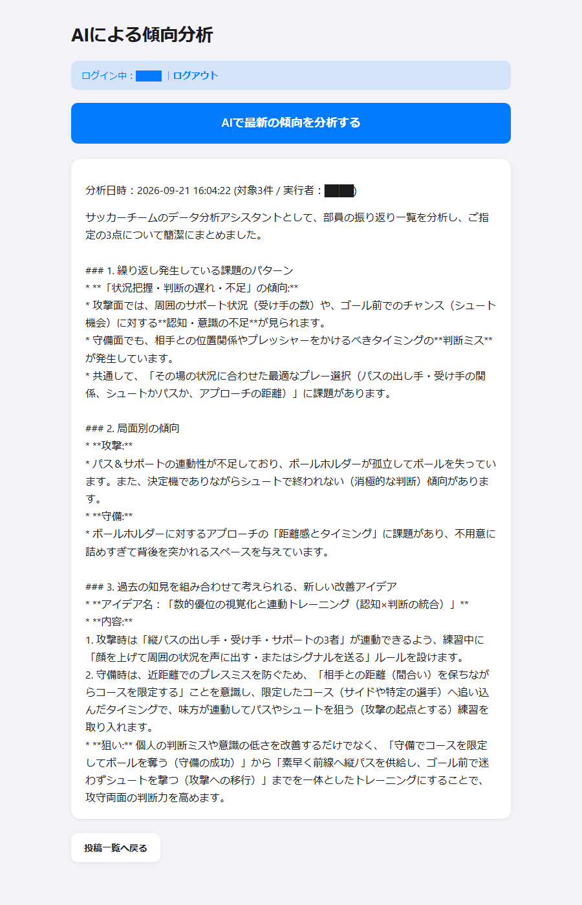
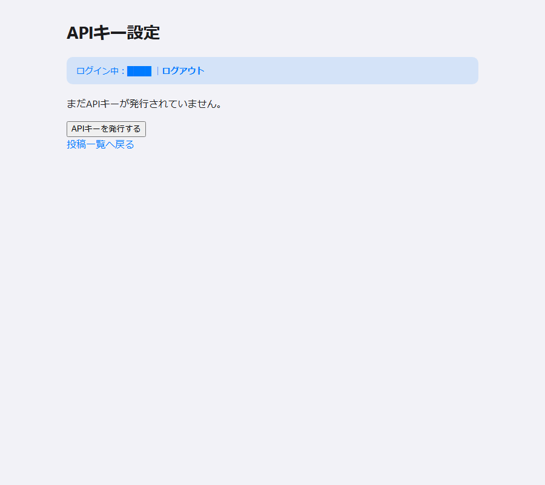
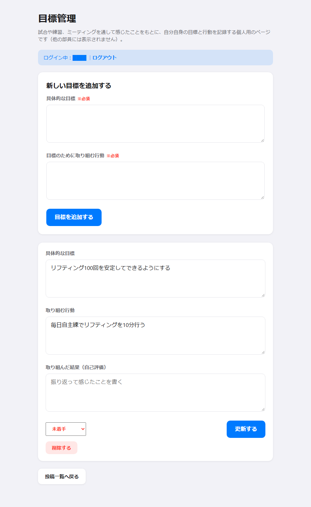

# ReflectLink

## 目次
### 1.	サービス概要
### 2.	制作背景・目的
### 3.	想定ユーザーと利用場面
### 4.	機能要件
### 5.	画面要件
### 6.	データ要件
### 7.	使用技術・開発環境
### 8.	非機能要件
### 9.	UI・UX上の工夫
### 10.	技術的な工夫と得られた学び
### 11. 今後の改善案 

## 1. サービス概要
### 1.1. サービス名
　ReflectLink：「振り返り（Reflect）」と「つながり（Link）」を組み合わせた名称である。振り返りを共有し、メンバー間の認識をつなぐという目的に由来する。

## 1.2. テーマ・概要
　本サービスは、試合で発生した課題、その原因、改善案を記録し、チーム内で共有するためのWebサービスである。  
　利用者は、文章や画像を用いて自身の振り返りを投稿できる。また、投稿の詳細画面では、指導者からフィードバックを受けたり、メンバー同士が役割やポジション別の視点から意見を共有したりできる。  
　振り返りを個人の中だけで終わらせず、チームの情報として蓄積することで、メンバー間の認識統一と継続的な改善を支援する。
当初は大阪公立大学体育会サッカー部での利用を想定するが、将来的には他競技のスポーツチームや組織でも利用できるサービスへの拡張を目指す。

## 2. 制作背景・目的
### 2.1. 制作背景
　体育会サッカー部の副主将としてチームの立て直しに取り組む中で、選手ごとに守備時の距離感や攻撃時のリスク管理に対する認識が異なり、それが連携不足につながっていることに気付いた。  
　映像を用いた週1回のミーティングによって認識の統一を進めたが、限られた時間では全員が十分に発言できず、試合で得た知見がその場限りとなり、過去の知見を活用できていないという課題が残った。そこで、時間や場所に縛られず、メンバーが振り返りを記録・共有できるようにするため、本サービスを制作した。
 
### 2.2. 目的
　本サービスの目的は、活動の中で生じた課題、その原因、改善案をチーム内で蓄積・共有することである。  
　指導者や異なる役割のメンバーが多角的な視点から意見を共有できる環境を設けることで、チーム内の認識差を小さくし、連携の向上と継続的な改善につなげる。 

## 3. 想定ユーザーと利用場面
### 3.1. 想定ユーザー
　導入初期は、大阪公立大学体育会サッカー部に所属する選手、監督、コーチ、スタッフなど、約90名の利用を想定する。  
　将来的には、他大学のサッカー部に加え、他競技のスポーツチームや組織でも利用できるサービスへの拡張を検討する。

### 3.2.	利用場面
When：試合・練習後、試合映像の確認時、ミーティングの前後等  
Where：部室、ミーティングルーム、自宅、移動中等  
Who：選手、監督、コーチ、スタッフ等  
Why (To What)：課題・原因・改善案を記録し、チーム内で認識を共有するため  
How： パソコン、スマートフォンなどのWebブラウザを用いる  

### 3.3.	利用の流れ
試合・練習を実施  
        ↓  
課題・原因・改善案を投稿  
        ↓  
監督・コーチ・選手が詳細を確認  
        ↓  
ポジション別にコメント  
        ↓  
改善案を実践  
        ↓  
改善状況を更新・再確認

## 4.	機能要件
F-01：ログイン・新規登録（名前・メールアドレス・ポジションでアカウントを作成し、ログインする）  
F-02：新規投稿（試合情報、課題、原因、改善案などを登録する）  
F-03：一覧表示（登録された振り返りを一覧で表示する）  
F-04：詳細表示（投稿内容、画像、コメントを詳しく表示する）  
F-05：投稿編集（投稿者本人のみ、投稿内容や改善状況を修正できる）  
F-06：投稿削除（投稿者本人のみ、指定した投稿を削除できる）  
F-07：コメント投稿（投稿に対する意見やフィードバックを登録する）  
F-08：画像アップロード（JPEG・PNG形式のプレー画像を投稿に添付する）  
F-09：コメント集計（ポジションなどの区分に基づいてコメントを集計・表示する）  
F-10：CSV出力（投稿データをCSVファイルとしてダウンロードする）  
F-11：文字数カウント（入力中の文字数をリアルタイムで表示する）  
F-12：AIによる傾向分析（蓄積した投稿をAIがまとめて分析し、繰り返し発生している課題や改善のヒントを提示する）  
F-13：外部連携用API（APIキーを発行し、外部のプログラムから投稿の取得・コメント投稿ができる）  
F-14：個人目標管理（試合やミーティングを通して感じたことをもとに、特定の投稿とは切り離した個人の目標・取り組む行動・自己評価を記録する。本人のみ閲覧・編集可能）  

### 4.1.	投稿時の入力項目
| 項目 | 入力形式 | 必須/任意 | 内容 |
|:---:|:---:|:---:|:---:|
| 試合名 | 1行入力 | 必須 | 対象となる試合名 |
| 試合日 | 日付入力 | 必須 | 試合を行った日 |
| プレーの局面 | 選択 | 必須 | 攻撃・守備などの局面 |
| カテゴリー | 選択 | 必須 | 課題の分類 |
| 発生した課題 | 複数行入力 | 必須 | プレーで生じた課題 |
| 原因 | 複数行入力 | 任意 | 課題が発生した原因（ミーティングでの話し合いを経てから追記してもよい） |
| 改善案 | 複数行入力 | 任意 | 次回に向けた改善方法（ミーティングやコメント欄での話し合いを経てから追記してもよい） |
| 改善状況 | 選択 | 必須 | 未実施・実施中・改善済みなど |
| プレー画像 | ファイル選択 | 任意 | JPEG・PNG形式の画像 |

　投稿者名はログイン中のアカウントから自動的に記録されるため、入力の手間はない。

## 5.	画面構成
### 5.1.	画面一覧
S-00：ログイン・新規登録画面（アカウントでログイン、または新規登録する）  
S-01：新規投稿画面（振り返りを登録する）  
S-02：投稿一覧画面（投稿を一覧表示し、各機能への入口を提供する）  
S-03：投稿詳細画面（投稿内容・画像・コメントを表示する）  
S-04：投稿編集画面（登録済みの投稿を修正する）  
S-05：コメント集計画面（コメントの集計結果を表示する）  
S-06：AI傾向分析画面（蓄積した投稿をAIが分析し、傾向をまとめて表示する）  
S-07：APIキー設定画面（外部連携用のAPIキーを発行・確認する）  
S-08：目標管理画面（投稿とは独立した、個人の目標・取り組む行動・自己評価を記録する）  

### 5.2.	画面遷移
【ログイン・新規登録画面】  
       ↓ ログイン  
【投稿一覧画面】  
       │  
       ├──→【新規投稿画面】  
       │  
       ├──→【投稿詳細画面】── コメント投稿  
       │  
       ├──→【投稿編集画面】  
       │  
       ├──→【目標管理画面】  
       │  
       ├──→【コメント集計画面】  
       │  
       ├──→【AI傾向分析画面】  
       │  
       └──→【APIキー設定画面】  

### 5.3.	画面イメージ
（名前が表示される欄は、部員の個人情報保護のためすべて黒塗りにしている）

図１　ログイン画面  
  

図２　投稿一覧画面（実際に投稿が並んだ状態）  
  

図３　新規投稿画面  
  

図４　投稿詳細画面（複数のポジションからコメントが付いた状態）  
  

図５　投稿編集画面  
  

図６　コメント集計画面  
  

図７　AI傾向分析画面（実際にAIが分析した結果）  
  

図８　APIキー設定画面  
  

図９　目標管理画面（Java/Spring Bootの別サービスと連携。投稿とは独立した個人用ページ）  
  

## 6.	データ要件
### 6.1. テーブル一覧
users：ログインするアカウント（名前・メール・ポジション・APIキー）を保存するテーブル  
soccer_posts：試合の振り返り内容と画像ファイル名を保存するテーブル  
categories：振り返り投稿を分類するカテゴリーを管理するテーブル  
comments：各投稿に対するフィードバックや意見を保存するテーブル  
ai_analyses：AIによる傾向分析の結果を保存するテーブル  
goals：個人の目標・取り組む行動・自己評価を保存するテーブル（別サービスのJavaアプリ「goal-service」が管理）  

### 6.2. 投稿テーブル
＜users＞
| カラム名 | データ型 | 説明 |
|---|---|---|
| id | int(11) | アカウントを一意に識別する番号 |
| name | varchar(100) | 表示名 |
| email | varchar(255) | ログインに使うメールアドレス |
| password_hash | varchar(255) | ハッシュ化したパスワード |
| api_key | varchar(64) | 外部連携用のAPIキー（未発行の場合は空） |
| position | varchar(20) | ポジション（GK・DF・MF・FW・監督スタッフ） |
| created_at | datetime | 登録日時 |  

＜soccer_posts＞
| カラム名 | データ型 | 説明 |
|---|---|---|
| id | int(11) | 投稿を一意に識別する番号 |
| match_name | varchar(255) | 振り返りの対象となる試合名 |
| match_date | date | 試合を実施した日付 |
| phase | varchar(50) | 攻撃・守備など、対象となるプレーの局面 |
| category_id | int(11) | 投稿に設定されたカテゴリーのID |
| issue | text | 試合やプレーで発生した課題 |
| cause | text | 課題が発生した原因（任意） |
| improvement | text | 課題に対する改善案（任意） |
| status | varchar(20) | 課題の改善状況 |
| user_id | int(11) | 投稿したアカウントのID |
| created_at | datetime | 投稿データを登録した日時 |
| image_name | varchar(255) | フォルダに保存した画像のファイル名 |  

＜categories＞
| カラム名 | データ型 | 説明 |
|---|---|---|
| id | int(11) | カテゴリーを一意に識別する番号 |
| category_name | varchar(50) | 画面に表示するカテゴリー名 |  

＜comments＞
| カラム名 | データ型 | 説明 |
|---|---|---|
| id | int(11) | コメントを一意に識別する番号 |
| post_id | int(11) | コメントの対象となる投稿のID |
| user_id | int(11) | コメントしたアカウントのID |
| comment | text | 投稿に対する意見やフィードバックの本文 |
| created_at | datetime | コメントを登録した日時 |  

＜ai_analyses＞
| カラム名 | データ型 | 説明 |
|---|---|---|
| id | int(11) | 分析結果を一意に識別する番号 |
| summary | text | AIがまとめた分析結果の本文 |
| post_count | int(11) | 分析対象にした投稿の件数 |
| generated_by | int(11) | 分析を実行したアカウントのID |
| created_at | datetime | 分析を実行した日時 |  

＜goals＞
| カラム名 | データ型 | 説明 |
|---|---|---|
| id | bigint(20) | 目標を一意に識別する番号 |
| user_id | int(11) | 目標を登録したアカウントのID |
| goal | text | 具体的な目標 |
| action_text | text | 目標のために取り組む行動 |
| result | text | 取り組んだ結果・自己評価（任意） |
| status | varchar(20) | 進捗状況（未着手・取り組み中・完了） |
| created_at | datetime | 登録日時 |
| updated_at | datetime | 最終更新日時 |  

### 6.3. テーブル間の関係
　1件の振り返り投稿に対して複数のコメントを登録できる構成とする。コメントは投稿IDを保持し、どの振り返りに対する意見であるかを関連付ける。また、投稿はカテゴリーIDによってカテゴリー情報と関連付ける。  
　投稿・コメントは、それぞれ投稿者・コメント者のアカウントID（users）を保持する。名前をそのつど自由入力する形式ではなく、ログイン中のアカウントと紐づける形にすることで、なりすましの防止と、本人だけが編集・削除できる仕組みを実現している。  

## 7.	使用技術・開発環境
### 7.1. 使用技術
<table>
  <thead>
    <tr>
      <th>区分</th>
      <th>使用技術</th>
      <th>用途</th>
    </tr>
  </thead>
  <tbody>
    <tr>
      <td rowspan="3">フロントエンド</td>
      <td>HTML</td>
      <td>画面の構造を作成</td>
    </tr>
    <tr>
      <td>CSS</td>
      <td>レイアウト、色、ボタンなどの装飾</td>
    </tr>
    <tr>
      <td>JavaScript</td>
      <td>文字数カウント、集計結果の表示など</td>
    </tr>
    <tr>
      <td rowspan="2">バックエンド</td>
      <td>PHP</td>
      <td>投稿・編集・削除・表示・CSV出力・API処理など</td>
    </tr>
    <tr>
      <td>PHPセッション</td>
      <td>ログイン状態の保持、本人以外の編集・削除の防止</td>
    </tr>
    <tr>
      <td>データベース</td>
      <td>MySQL</td>
      <td>アカウント、投稿、コメント、カテゴリなどのデータ管理</td>
    </tr>
    <tr>
      <td>生成AI</td>
      <td>Google Gemini API</td>
      <td>蓄積した投稿データの傾向分析</td>
    </tr>
    <tr>
      <td>外部連携</td>
      <td>JSON API（APIキー認証）</td>
      <td>外部プログラムからの投稿取得・コメント投稿</td>
    </tr>
    <tr>
      <td rowspan="2">目標管理サービス(goal-service)</td>
      <td>Java 21 / Spring Boot</td>
      <td>PHP本体とは別プロセスで動く、個人の目標・行動・自己評価を管理するサービス</td>
    </tr>
    <tr>
      <td>Spring Data JPA</td>
      <td>Java側からMySQLへのデータ操作</td>
    </tr>
    <tr>
      <td>データ形式</td>
      <td>CSV</td>
      <td>投稿データのダウンロード</td>
    </tr>
    <tr>
      <td>画像形式</td>
      <td>JPEG/PNG</td>
      <td>プレー画像のアップロード</td>
    </tr>
  </tbody>
</table>  

### 7.2. 開発環境
OS：Windows 11  
コードエディタ：Visual Studio Code、Claude Code  
Webサーバー：TECH-BASEのサーバー（開発初期）、ローカルPHP環境（機能追加以降）  
データベース管理：phpMyAdmin、MySQL/MariaDBクライアント  
Java開発環境：JDK 21 (Eclipse Temurin)、Apache Maven  
動作確認ブラウザ：Google Chrome/Microsoft Edge  
バージョン管理：GitHub  
公開環境：InfinityFree（部内利用のため、URLは非公開）  

## 8.	非機能要件
NF-01：操作性（初めて利用する人でも、ボタン名から操作内容を理解できる）  
NF-02：視認性（詳細・編集・削除などの操作を色によって区別）  
NF-03：誤操作防止（削除ボタンをほかの操作から離して配置し、赤色で注意を促す）  
NF-04：入力支援（入力中の文字数と上限を確認できる）  
NF-05：対応画像（JPEG/PNG形式の画像を扱える）  
NF-06：データ活用（投稿内容をCSV形式で保存できる）  
NF-07：対応端末：（パソコンとスマートフォンのブラウザで内容を確認でき）  
NF-08：保守性（CSSやJavaScriptを別ファイルに分け、修正箇所を管理しやすい構成）  
NF-09：秘匿性（パスワードはハッシュ化して保存し、データベースの接続情報やAPIキーはGitHubに含めない）  

## 9.	UI/UX上の工夫
### 9.1.	多角的なフィードバック
　投稿詳細画面にコメント欄を設け、監督・コーチ陣からの客観的なフィードバックや、ポジション別の意見を共有できるようにした。  
　これにより、投稿者だけでは気付けなかった課題を発見し、ポジションによって異なる判断や考え方を相互に理解することが可能となる。その結果、チーム内の認識差を小さくし、試合中の連携改善に繋げられる。  

### 9.2.	誤操作を防ぐ画面設計
　削除ボタンは、編集や詳細表示のボタンから離れた端に配置し、注意を連想しやすい赤色にした。  
　重要な操作を位置と色によって区別することで、誤って削除する可能性を減らすなど、細部のUI・UXにも配慮した。  

### 9.3.	振り返りを支援する機能
画像アップロード：選手の位置関係やスペースを視覚的に共有できる。  
コメント集計：どの立場やポジションから意見が出ているかを把握できる。  
文字数カウント：入力状況を確認しながら、内容を適切な長さに整理できる。  
CSVダウンロード：蓄積した投稿を保存・共有し、表計算ソフトなどで整理できる。  

## 10.	技術的な工夫と得られた学び
### 10.1.	自由入力からアカウントの仕組みへ
　最初は投稿者名やコメント者名を自由入力にしていたが、これだと誰でも他人の名前で投稿でき、なりすましができてしまう。そこでログイン機能を作り、「どのアカウントが投稿・コメントしたか」をシステム側で管理する形に変更した。あわせて、自分の投稿しか編集・削除できないよう、サーバー側でチェックする仕組みを追加した。実際に他人の投稿番号をURLに直接入力して編集しようとしても、弾かれることをテストで確認している。  

### 10.2.	AIに「知見を組み合わせて」考えさせるための工夫
　蓄積した投稿をそのままAIに渡すだけでは、ただの要約になってしまう。そこで、「①繰り返し起きている課題」「②攻撃・守備などの局面ごとの傾向」「③過去の投稿を組み合わせた新しい改善案」の3点を答えてもらうよう、AIへの依頼文（プロンプト）を具体的に設計した。これにより、複数の投稿をまたいで気づきを組み合わせた提案をAIが返すようになった。また開発中、使っていたAIのモデル（種類）が急に廃止される出来事があったため、モデルを固定で指定せず、常に最新版を自動で使う設定に変更し、今後モデルが変わっても困らないようにした。  

### 10.3.	外部からも使えるAPIの追加
　将来、他のアプリやシステムからもReflectLinkのデータを扱えるように、通常のブラウザログインとは別に、プログラム用の「合言葉」のようなAPIキーを発行できる機能を作った。このキーを使えば、外部のプログラムが投稿の取得やコメントの投稿を行える。キーが間違っている、指定した投稿が存在しないなど、失敗のパターンごとに分かりやすいエラーメッセージを返すようにしている。  

### 10.4.	開発中に見つけて対応した問題
　ログインが保持されない不具合：画面の表示を始めた後にログインチェックをしていたため、ブラウザにログイン情報がうまく伝わらず、ログインしたはずなのにすぐ外れてしまうことがあった。チェックを処理の一番最初に移して直した。  
　文字化け：データベースに接続するときの文字コードの指定を忘れていたため、環境によっては日本語が正しく保存されないことがあった。文字コードをはっきり指定することで直した。  
　無料の公開環境ならではの制限：無料のホスティングサービスにデプロイしたところ、データベース側でデータの矛盾を自動的に防ぐ機能の一部が使えないことが分かった。その分をプログラム側のチェックで補う設計にした。  
　AIの応答が一時的に失敗する：生成AIへの問い合わせは、混雑時にまれに失敗することがある。失敗してもエラーの中身をそのまま見せるのではなく、分かりやすい日本語のメッセージを表示し、もう一度試せば大抵成功するようにした。  
　Java起動時のエラー：フォルダ名に日本語（「デスクトップ」）が含まれる環境だと、Javaの標準的な起動方法（`mvn spring-boot:run`）でクラスが見つからないというエラーが出た。実行可能な1つのファイル（jarファイル）にまとめてから起動する方法に変えることで解決した。  

### 10.5.	PHPとJavaを分けてみた
　個人の目標を記録する機能は、PHP本体とは別に、Java（Spring Boot）で作った別サービス（goal-service）として実装した。PHPの画面からは、直接データベースを触るのではなく、Javaが用意したAPI（決まった形式でのやり取り窓口）にリクエストを送って結果を受け取る形にしている。  
　こうすることで、この機能側でエラーが起きても、投稿やログインなどPHPで作った他の機能には影響しない。異なる言語のプログラム同士を、決まった約束事（API）でつなげる経験ができた。  

### 10.6.	リポジトリの整理
　機能を追加するたびにファイルが増え、リポジトリのトップページが見づらくなっていた。そこで、①複数に分かれていたデータベースの構築用SQLファイルを1本（schema.sql）にまとめる、②db.phpやauth.phpなど画面を持たない共通処理のファイルをincludesフォルダに集約する、という整理を行った。機能ごとにファイルを分けることと、見やすさを両立させることの大切さを学んだ。  

## 11.	今後の改善案
　以下の改善を段階的に実施し、単なる振り返りの記録にとどまらず、選手、監督、コーチが課題と改善案を継続的に共有できるサービスを目指す。蓄積された情報をチーム全体の成長に活用し、将来的にはさまざまなサッカーチームで利用できるサービスへ発展させる。  

### 11.1.	動画アップロード機能
　試合や練習の動画をアップロードできる機能を追加する。静止画だけでは伝わりにくいプレーの前後関係、選手の動き、判断のタイミングを共有し、より具体的な振り返りを可能にする。  

### 11.2.	複数チームへの対応
　導入初期は大阪公立大学体育会サッカー部での利用を想定する。将来的にはチームごとに投稿やコメントを管理し、他大学や社会人チームでも利用できる構成へ拡張する。  

### 11.3.	通知機能
　新しい投稿やコメントが追加された際に、関係するユーザーへ通知する機能を追加する。また、改善状況が変更された場合にも通知し、振り返りや改善活動の確認漏れを防ぐ。将来的には、サイト内通知だけでなく、メールなどを利用した通知も検討する。  

### 11.4.	お気に入り・重要投稿機能
　後から確認したい投稿をお気に入りとして保存したり、チーム全体で共有すべき投稿を重要投稿として設定したりできる機能を追加する。重要な振り返りが他の投稿に埋もれることを防ぎ、練習前やミーティング時に見直しやすくする。  


## 注意事項
データベース接続情報は、セキュリティ保護のため伏字にしている。  
本サービスは部員の個人情報（氏名等）を扱うため、本番環境のURLは公開していない。画面構成は上記のスクリーンショットを参照。

## 付録：外部連携API仕様
外部システム(スマホアプリ等)からReflectLinkのデータを利用するためのJSON REST API。

### 認証
`api_settings.php` で発行したAPIキーを、リクエストヘッダーに付与する。
```
Authorization: Bearer <APIキー>
```

### GET /api/posts.php
投稿一覧を取得する。パラメータ：`limit`(任意、デフォルト20、最大100)

レスポンス例：
```json
{
  "posts": [
    {
      "id": 2,
      "match_name": "経大戦",
      "match_date": "2026-09-15",
      "phase": "守備",
      "category_name": "守備",
      "status": "実践中",
      "player_name": "山田花子",
      "created_at": "2026-09-20 23:09:00"
    }
  ],
  "count": 1
}
```

### GET /api/posts.php?id={id}
投稿1件の詳細(コメント含む)を取得する。

### POST /api/comments.php
投稿にコメントを追加する。

リクエストボディ(JSON)：
```json
{ "post_id": 2, "comment": "コメント本文" }
```

### エラー形式
```json
{ "error": "エラーメッセージ" }
```

| ステータス | 意味 |
|---|---|
| 400 | リクエスト形式が不正 |
| 401 | APIキーが無効・未指定 |
| 404 | 指定した投稿が存在しない |
| 405 | 許可されていないHTTPメソッド |
